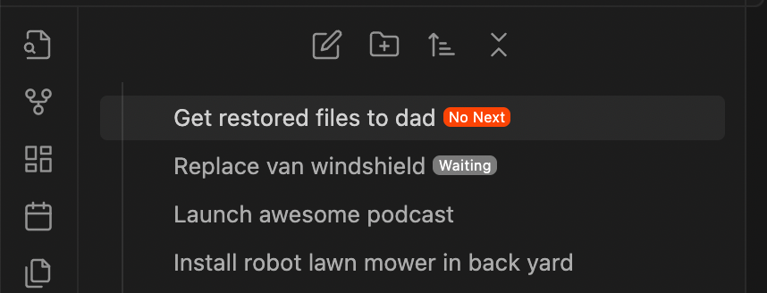

# GTD: No Next Step

Obsidian plugin for GTD workflow that adds a badge to projects with no defined next step.

## My GTD Workflow

My workflow in Obsidian is that each GTD "project" is a file within a folder named "Projects":

```
Projects/
	Get restored files to dad.md
	Launch awesome podcast.md
	Replace van windshield.md
```

I also use the [Tasks](https://publish.obsidian.md/tasks/) plugin, which lets you add tasks like normal, and add views that query them:

```md
- [ ] call Fred to get the phone number of the windshield place #next-step
```

This works well for me, because I can set up task queries for `#next-step` tagged tasks:

```md
\```tasks
not done
tags includes #next-step
\```
```

I also use the `#waiting-for` tag to indicate things that are a Next Step but rely on an external party:

```md
- [ ] #waiting-for Fred to get back to me with the windshield guys number
```

## Motivation for Plugin

What I would like to know is whether there are any "projects" (files in the "Projects" folder) that do not have a Next Step, and are not Waiting For.

These project files would need examination, probably some tidying: maybe the project is complete, or maybe I haven't actually gone through the mental effort of deciding the next step.

## What it Looks Like



## License

Published and made available freely under the [Very Open License](http://veryopenlicense.com/).
